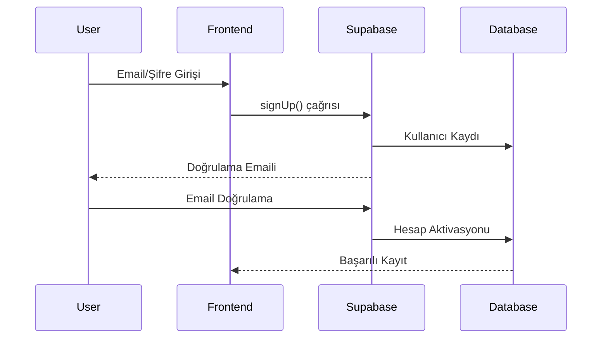
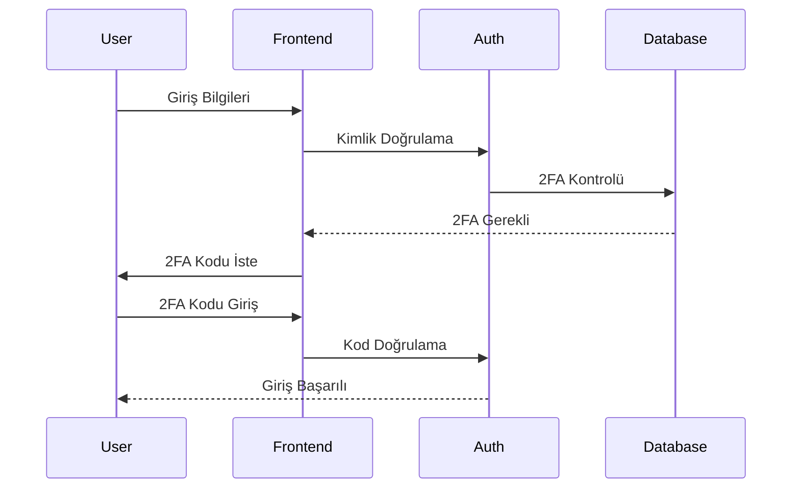

# Kullanıcı Kimlik Doğrulama Akışı

## Genel Bakış

Lola kariyer mentoru uygulaması, Supabase Auth altyapısını kullanarak güvenli ve esnek bir kimlik doğrulama sistemi sunar. Bu sistem, farklı kimlik doğrulama yöntemlerini destekler ve çeşitli güvenlik önlemleriyle korunur. Tüm güvenlik logları ve ilgili fonksiyonlar için bkz: [security_logs.sql](../code_examples/security_logs.sql)

## Kimlik Doğrulama Yöntemleri

### 1. Email/Şifre ile Kayıt


### 2. Sosyal Medya ile Giriş
- Google ile giriş
- LinkedIn ile giriş
- GitHub ile giriş

### 3. Magic Link ile Giriş
- Email tabanlı bağlantı
- Tek kullanımlık kodlar
- Zaman sınırlı erişim

## Güvenlik Kontrolleri

1. **Email Doğrulama**
   - Zorunlu email doğrulama
   - Doğrulama süresi sınırı
   - Yeniden gönderme limitleri

2. **Şifre Politikası**
   - En az 8 karakter
   - En az 1 büyük harf
   - En az 1 küçük harf
   - En az 1 rakam
   - En az 1 özel karakter

3. **Giriş Denemeleri**
   - 5 başarısız denemeden sonra hesap kilitleme
   - Progressive delay ile bekleme süreleri
   - IP tabanlı rate limiting

## İki Faktörlü Kimlik Doğrulama (2FA)

### Kurulum Akışı
1. Kullanıcı 2FA'yı etkinleştirir
2. QR kod veya manuel kod gösterimi
3. Doğrulama kodu onayı
4. Yedek kodların oluşturulması

### Kullanım


## Oturum Yönetimi

1. **JWT Token Yapısı**
   ```json
   {
     "iss": "supabase",
     "sub": "user_id",
     "role": "authenticated",
     "exp": 1643673600,
     "session_id": "uuid",
     "user_metadata": {
       "name": "User Name",
       "email": "user@example.com"
     }
   }
   ```

2. **Token Yenileme**
   - Access token: 1 saat
   - Refresh token: 7 gün
   - Otomatik yenileme mekanizması

## Güvenlik Logları

Her kimlik doğrulama işlemi için güvenlik logları tutulur. Log yapısı ve örnek kullanımlar için bkz: [security_logs.sql](../code_examples/security_logs.sql)

Önemli log olayları:
- Giriş denemeleri
- Şifre değişiklikleri
- 2FA aktivasyonları
- Şüpheli aktiviteler

## Hata Yönetimi

1. **Genel Hatalar**
   - Geçersiz kimlik bilgileri
   - Hesap kilitli
   - Email doğrulanmamış
   - 2FA gerekli

2. **Özel Hata Kodları**
   ```json
   {
     "AUTH001": "Geçersiz email formatı",
     "AUTH002": "Şifre politikası ihlali",
     "AUTH003": "Hesap kilitli",
     "AUTH004": "2FA gerekli",
     "AUTH005": "Token süresi dolmuş"
   }
   ```

## Güvenlik Tavsiyeleri

1. **Kullanıcılar İçin**
   - Güçlü şifre kullanımı
   - 2FA'nın etkinleştirilmesi
   - Güvenli cihaz kullanımı
   - Şüpheli aktivite bildirimi

2. **Geliştiriciler İçin**
   - Token güvenliği
   - HTTPS kullanımı
   - XSS ve CSRF koruması
   - Rate limiting uygulaması
