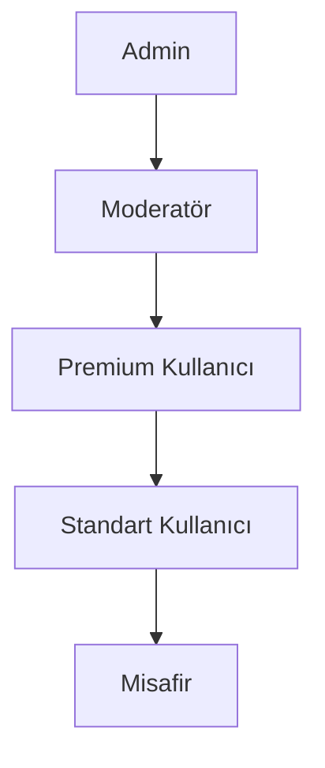

# Rol Tabanlı Erişim Kontrolü (RBAC)

## Genel Bakış

Lola kariyer mentoru uygulaması, farklı kullanıcı tiplerinin sistem kaynaklarına erişimini kontrol etmek için kapsamlı bir RBAC sistemi kullanır. 

- Veritabanı tabloları ve fonksiyonlar için bkz: [rbac_tables.sql](../code_examples/rbac_tables.sql)
- Erişim politikaları ve kontroller için bkz: [rbac_policies.sql](../code_examples/rbac_policies.sql)

## Rol Hiyerarşisi

## Rol Tanımları

### 1. Admin
- Tam sistem erişimi
- Kullanıcı yönetimi
- İçerik yönetimi
- Güvenlik politikaları
- Sistem konfigürasyonu
- Analitik raporları

### 2. Moderatör
- Chat moderasyonu
- İçerik onaylama
- Kullanıcı raporları
- Destek talepleri
- İçerik denetimi
- Topluluk yönetimi

### 3. Premium Kullanıcı
- Tüm özelliklere erişim
- Öncelikli destek
- Özel içerikler
- Gelişmiş analitikler
- Sınırsız AI etkileşimi
- Özelleştirilmiş öneriler

### 4. Standart Kullanıcı
- Temel özellikler
- Sınırlı AI etkileşimi
- Temel raporlar
- Topluluk erişimi
- Basit analitikler
- Genel içerikler

### 5. Misafir
- Salt okunur erişim
- Örnek içerikler
- Kayıt sayfası
- Tanıtım özellikleri
- Sınırlı görüntüleme
- Demo özellikler

## Erişim Kontrol Seviyeleri

### 1. Veritabanı Seviyesi
- Row Level Security (RLS)
- Rol bazlı politikalar
- Veri maskeleme

### 2. API Seviyesi
- Endpoint bazlı kontroller
- Token doğrulama
- Rate limiting

### 3. Frontend Seviyesi
- Korumalı rotalar
- UI element kontrolü
- Yetki bazlı navigasyon

## En İyi Uygulamalar

1. **Minimum Yetki Prensibi**
   - Her rol için minimum gerekli izinler
   - Geçici yetki yükseltme mekanizması
   - Düzenli yetki gözden geçirme

2. **Rol Ataması**
   - Çift onay sistemi
   - Değişiklik gerekçesi
   - Otomatik bildirimler

3. **Güvenlik Önlemleri**
   - Rol değişiklik limitleri
   - Kritik rol koruma
   - Yetki kötüye kullanım tespiti

4. **Erişilebilirlik**
   - Rol bazlı klavye kısayolları
   - Ekran okuyucu uyumluluğu
   - Mobil-uyumlu yetki kontrolleri
